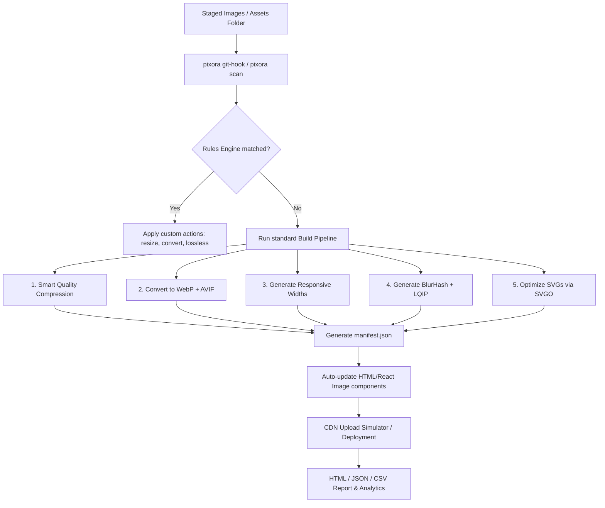

# ⚡ Pixora — Developer Asset Optimization Platform

> Fast, automated, cross-platform Automated Asset Pipeline for Modern Web Apps built on [sharp](https://sharp.pixelplumbing.com/).

[](https://www.npmjs.com/package/@dhananjay_verma9546/pixora-compress)
[](LICENSE)
[](package.json)

Pixora is an Automated Asset Pipeline for Modern Web Apps. Compress, convert, audit, generate responsive image sets, extract color palettes, bundle sprite sheets, detect subjects using lightweight heuristics, simulate CDNs, run visual diffs, and configure custom workflow engines.

---

## 🔄 Pixora Automation Workflow

Here is how Pixora automates your development pipeline:



---

## ✨ Features & Capabilities

### 🚀 1. Core Optimization & Compression
* **In-Place Compression**: Run standard optimizations on existing JPEGs, PNGs, and GIFs using `pixora compress`.
* **Format Conversion**: Convert files dynamically into modern formats (WebP, AVIF, JPEG, PNG, TIFF) using `pixora convert --to <format>`.
* **Smart Width Resizing**: Scale images to a specific width without enlargement or aspect ratio distortion.
* **Target Size Budgeting**: Target a specific file size (e.g. `--max-size 300kb`), dynamically computing the optimal quality parameters.
* **Smart Quality Rules**: Auto-detects optimal compression quality limits per image type (e.g., Photos compress lower, logos/screenshots keep higher density).
* **Metadata Stripping**: Preserve or remove EXIF/IPTC/XMP metadata during compression.

### 🌐 2. Generation & Layout Assets
* **BlurHash Placeholders**: Extracts beautiful CSS-friendly BlurHash strings for instant skeleton loader previews.
* **LQIP (Low Quality Image Placeholders)**: Generates base64 embedded preview buffers for smooth blur-in loading states.
* **Responsive Responsive Widths**: Outputs resized versions of an image (320w, 640w, 768w, 1024w, 1440w, 1920w) instantly.
* **Sprite Sheet Compiler**: Bundles directories of icons into single CSS-mapped sprite sheets.
* **SVG Optimizer**: Minimizes SVG vectors via built-in SVGO configurations.
* **App Icon Generator**: Generates full icon assets for iOS, Android, PWAs, Favicons, and Apple Touch previews from a single PNG file.
* **Open Graph social previews**: Smart Attention-cropping for social network dimensions (Facebook, Twitter Cards, Discord, WhatsApp).

### 📊 3. Analysis, Auditing & Scanners
* **Project Scanner (`pixora scan`)**: Crawls code directories (`.html`, `.jsx`, `.tsx`, etc.) to find broken image links, missing `loading="lazy"` tags, unused media, and duplicate visual assets.
* **Heuristic Subject Detection**: Detects layout structures (portrait, landscape, square), text-density layout blocks, and counts faces via skin-tone heuristics.
* **Visual Diff Metric Comparison**: Computes SSIM (Structural Similarity Index), PSNR, and MSE to analyze image degradation.
* **Visual Diff Heatmaps**: Outputs a visual blue-to-red diff overlay image highlighting exact pixel alterations.
* **Interactive Performance Scorer**: Rates folders 0–100 on modern layout choices, metadata footprint, and format optimization.

### ⚙️ 4. Automation & Integration
* **Workflow Engine (`pixora workflow`)**: Chain scan, build, report, API, and analytics steps using custom YAML/JSON step files.
* **Rules Engine (`pixora rules`)**: Apply custom conditionals to folders (e.g., `if: size > 2MB → action: [compress, resize:1920]`).
* **Git Commit hook**: Pre-commit hook optimizing newly added staged images automatically during every `git commit`.
* **Framework Recipes**: Special templates for `nextjs`, `react`, `vite`, and `astro` projects.
* **Dev Server & CDN Simulator**: Run a local dev server simulating on-the-fly transformations (e.g. `?w=300&format=webp`).
* **Interactive Web Dashboard**: Graphical charts showing savings, format distributions, and CDN statistics served at `/__dashboard`.
* **VS Code Extension**: Optimize assets and run audits directly from your editor.

---

## 📥 Installation

```bash
# Install globally for CLI usage
npm install -g @dhananjay_verma9546/pixora-compress

# Or add locally to your project's devDependencies
npm install --save-dev @dhananjay_verma9546/pixora-compress

# Or run instantly without installation
npx @dhananjay_verma9546/pixora-compress build ./assets
```

---

## 🚀 CLI Commands Reference

### 1. Build Pipeline
Optimizes all images, generates responsive sets, optimizes SVGs, and outputs a `manifest.json`:
```bash
pixora build ./src/assets -o ./dist/public -q 80
```

### 2. Project Scanner
Scan code files and folder structures for broken paths, missing formats, duplicates, and missing `loading="lazy"` tags:
```bash
# Scan and print issues
pixora scan ./src

# Scan and automatically resolve duplicates, compress large images, and generate formats
pixora scan ./src --fix
```

### 3. Image Analysis & Performance Score
```bash
# Analyze layout type, transparent channels, and details
pixora analyze ./assets/hero.png

# Grade folder layout, sizing, and formats from 0-100
pixora score ./assets
```

### 4. Extract Palette
Extracts a 5-color semantic brand palette and formats for CSS variables or Tailwind configs:
```bash
pixora palette logo.png --tailwind
```

### 5. App Icons & Social Open Graph Assets
```bash
pixora icons icon.png -o ./public/icons
pixora og image.png -o ./public/og
```

### 6. Difference Heatmaps
Generate structural diff heatmaps comparing original and optimized files:
```bash
pixora compare original.jpg compressed.webp --heatmap
```

### 7. CDN Dev Server & Web Dashboard
```bash
# Start local server on port 4000 and open live dashboard
pixora dashboard ./assets -p 4000
```

---

## ⚙️ Rules & Workflows

### Rules Config (`rules.json`)
```json
{
  "rules": [
    {
      "if": "size > 2MB",
      "action": ["compress", "resize:1920"]
    },
    {
      "if": "extension == png",
      "action": ["convert:webp"]
    }
  ]
}
```
Run rules:
```bash
pixora rules ./assets -c ./rules.json
```

### Workflow Config (`workflow.json`)
```json
{
  "name": "Production Optimization",
  "steps": [
    "scan",
    "build",
    "report"
  ]
}
```
Run workflow:
```bash
pixora workflow ./workflow.json ./assets
```

---

## 💎 Framework Recipes

Run specialized integration recipes for your chosen framework workspace:
```bash
# Automatically optimize and wire assets in React, Next.js, Vite, or Astro
pixora recipe nextjs ./my-next-app
pixora recipe react ./my-react-app
pixora recipe astro ./my-astro-app
```

---

## ⚓ Git Integration

Install the automatic pre-commit hook:
```bash
pixora git-hook ./
```
Every `git commit` will automatically detect, optimize, and replace staged images.

## 🔌 Integrations & Ecosystem

Pixora provides a full developer asset optimization ecosystem with various integrations:

### 1. VS Code Extension
Located in [vscode-extension/](file:///Users/laptopbazaar/Desktop/image/vscode-extension), this extension lets you optimize and audit assets directly within your editor.
* **Right-Click Compression**: Right-click any image in the explorer sidebar and select **Pixora: Compress Image** to optimize it in-place.
* **Workspace Auditing**: Command **Pixora: Audit Workspace for Unoptimized Assets** highlights which files are missing modern formats or need optimization.
* For more details, see the [vscode-extension/README.md](file:///Users/laptopbazaar/Desktop/image/vscode-extension/README.md).

### 2. Vite Plugin
Runs as a build-time step during `vite build` to optimize and convert assets automatically in the output bundle.
```typescript
import { pixoraPlugin } from '@dhananjay_verma9546/pixora-compress/plugins/vite';

export default {
  plugins: [
    pixoraPlugin({
      quality: 80,
      formats: ['webp', 'avif']
    })
  ]
}
```

### 3. Next.js Plugin
Automatically optimizes your `public/` directory assets during Next.js production builds.
```javascript
const { withPixora } = require('@dhananjay_verma9546/pixora-compress/plugins/next');

module.exports = withPixora({
  // Your nextConfig
}, {
  quality: 80,
  formats: ['webp']
});
```

### 4. GitHub Action
Integrate Pixora directly into your CI/CD pipelines to validate, optimize, and automatically commit compressed assets.
```yaml
- name: Pixora Asset Optimizer
  uses: ./ # References the root action.yml
  with:
    input: './public/images'
    quality: '85'
    formats: 'webp,avif'
    commit-changes: 'true'
```

### 5. Docker Support
Pixora can run in a sandboxed Docker container, preconfigured to host the Local REST API server.
```bash
# Build the image
docker build -t pixora-platform .

# Run the REST API server on port 3333
docker run -p 3333:3333 pixora-platform
```

### 6. Local REST API Mode
Start a dedicated asset optimization and analytics microservice locally:
```bash
pixora api --port 3333
```
* **POST `/compress`**: Compresses an image file on disk or accepts raw binary / multipart uploads.
* **POST `/analyze`**: Analyzes the layout type, transparent channels, and details.
* **POST `/palette`**: Extracts a semantic color palette.
* **POST `/score`**: Grades project assets folder layout, sizing, and formats.
* **POST `/meta`**: Extracts file metadata.

---

## 📦 Programmatic API

You can also import Pixora directly in your Node.js scripts and build files:

```typescript
import { compress } from '@dhananjay_verma9546/pixora-compress';

const result = await compress('./images/hero.png', {
  output: './dist',
  formats: ['webp', 'avif'],
  width: 1200,
  quality: 80
});

console.log(`Saved ${result.summary.savedPercent}%`);
```

---

## 🛡️ License

MIT License. Copyright (c) 2026.
